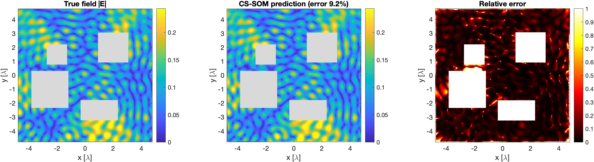
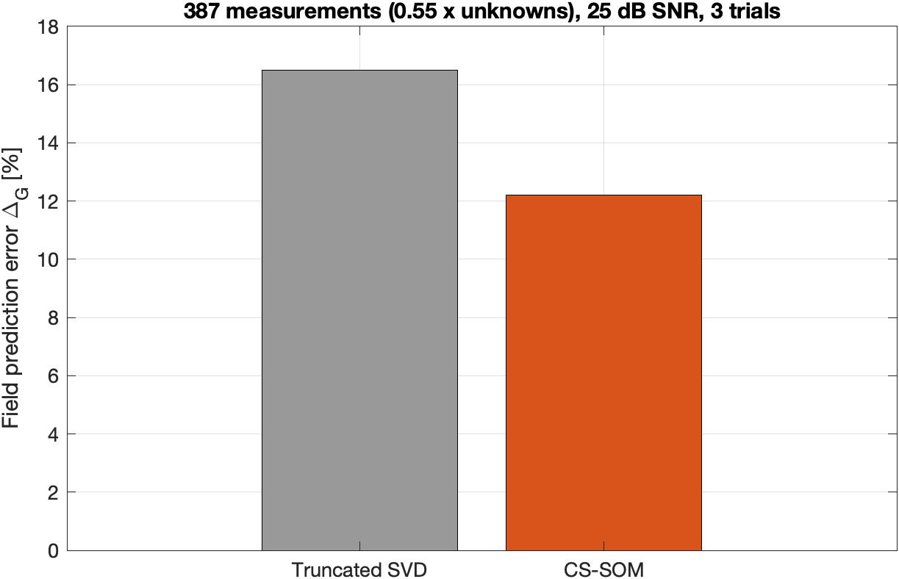

# Compressive Sensing Approaches for the Prediction of Scattered Electromagnetic Fields

MATLAB code for

> C. Bhat, K. Sastry, and U. K. Khankhoje,
> **"Compressive sensing approaches for the prediction of scattered electromagnetic fields,"**
> *Journal of the Optical Society of America A*, vol. 37, no. 7, pp. 1166–1174, 2020.
> [doi:10.1364/JOSAA.388136](https://doi.org/10.1364/JOSAA.388136)

## The problem

A Wi-Fi router in a room with furniture: can the electromagnetic field be predicted
**everywhere** in the room from a **few** measurements, without knowing what the objects
are made of? Interpolation needs sub-wavelength sampling, and ray tracing breaks down in the
near field and with multiple scattering.

## Method: CS-SOM

- **Physics.** By Huygens' principle, the field anywhere in the room is fixed by the
  tangential electric and magnetic fields on the surfaces of the objects and walls. The
  extinction theorem adds consistency relations between them (the *state* equation). Only
  the free-space Green's function is needed, so the object permittivities stay unknown.
  The objects are replaced by rough bounding boxes.
- **Inverse problem.** Measurements b relate to the tangential fields x by b = A x + noise,
  with fewer measurements than unknowns.
- **Compressive-sensing subspace optimisation (CS-SOM).** Split x into a *signal-space* part
  (truncated SVD of A, truncation set by Morozov's discrepancy principle) and a
  *noise-space* part found by **ℓ1 minimisation in the DCT domain** (the tangential fields
  are sparse there), subject to both the data and state equations (CVX).
- **Prediction.** Predict the field at any point with Huygens' principle, f = B x.

## Results (paper setup: 10λ × 10λ room, 4 lossy objects + wall, 704 unknowns)

387 random measurements (0.55 × the number of unknowns), 25 dB SNR:





| Method | Field prediction error Δ_G (this run, 3 trials) | Paper (100 trials) |
|---|---|---|
| Truncated SVD | 16.5% | 19% |
| **CS-SOM** | **12.2%** | **12%** |

Errors concentrate near the walls and between closely spaced objects, where few
measurements fall, as reported in the paper.

## Running

Requirements: MATLAB (tested with R2024a) and [CVX](http://cvxr.com/cvx) on the path.

```matlab
run_all      % about 15-20 minutes on a laptop; writes figures/
```

`run_all.m` runs the research scripts in `code/` in order:

| Step | Script | Output |
|---|---|---|
| 1 | `Closed_oneObj1.m` | forward solver (boundary integral, λ/40): exact surface fields |
| 2 | `true_2d_field.m` | true field on the 10λ × 10λ grid |
| 3 | `generate_truetangfields_all_surfaces.m` | true tangential fields on the bounding boxes |
| 4 | `tang_interpolate.m` | … resampled at λ/5 (for the tangential-field error) |
| 5 | `generate_matrices.m` | random measurement sets, noisy data, system matrices A (λ/5) |
| 6 | `generate_state_eqn.m` | state matrix A_s (extinction theorem) |
| 7 | `Prediction_matrix_one_time.m` | prediction matrix B for the grid |
| 8 | `Inverse_solver_25dB_055.m` | CS-SOM and truncated-SVD solutions, errors |

The number of random measurement sets is `n_iter` in `generate_matrices.m` and
`Inverse_solver_25dB_055.m` (3 here; the paper averages 100 Monte Carlo trials).

## Notes

- This is the research code used for the paper, organised to run end to end. The
  regenerated forward solution, true fields and state equation match the original 2020
  data files to machine precision, and the field-prediction error reproduces the paper.
- The tangential-field error Δ_T of the paper (22%) is not reproduced by this version of
  the state equation; the field prediction on the grid, the paper's main result, is.
- Within the solver, `nm1` is CS-SOM as in the paper (Eq. 10: data and state
  constraints); the other branches are variants explored during the work.

## License

MIT, see [LICENSE](LICENSE). If you use this code, please cite the paper above.
